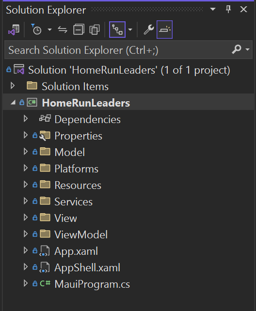

### Open Solution in Visual Studio

1. Open **1-Start/HomeRunLeaders.sln**

You should see 1 project:

- HomeRunLeaders - This is the main .NET MAUI project. This project targets Android, iOS, macOS, and Windows. It also includes some scaffolding for the app including Models, Views, ViewModels and Services.

### NuGet Restore

All the NuGet packages required should be installed. You will want to restore the packages from the internet.

1. **Right-click** on the **Solution** and select **Restore NuGet packages** 

### Models

There is a Model folder in the solution. All the models needed should already be there. The **Leaders**, **Player**, **Statistics**, and **Team** were generated from data retrieved from the web. 

1. Go to this URL [https://sports.core.api.espn.com/v2/sports/baseball/leagues/mlb/seasons/2024/types/2/leaders?lang=en&region=us](https://sports.core.api.espn.com/v2/sports/baseball/leagues/mlb/seasons/2024/types/2/leaders?lang=en&region=us) to see the Leader data that we will be working with. If you select all the returned data (ctrl-a, ctrl-c) and go to the Visual Studio Edit menu you will see the **Paste Special** option. Hover over it and you will see the **Paste Json as Classes** option. This is what was used to get this model as well as the Player model.

The HomeRuns model was built by hand.