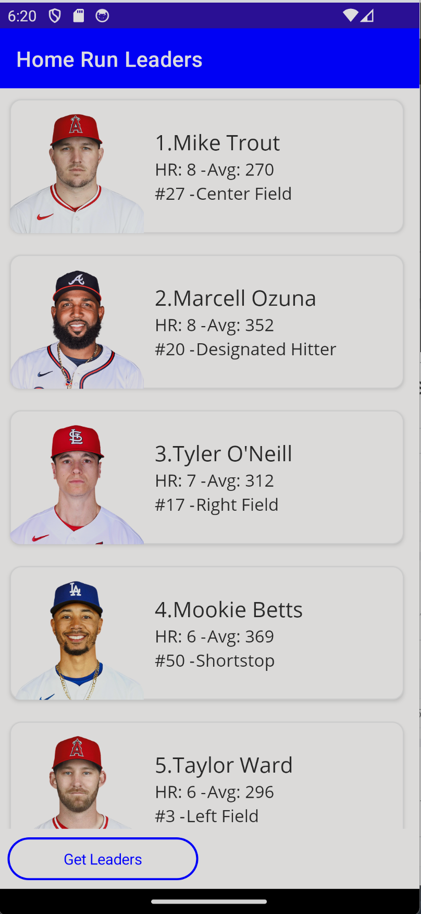

## Data Binding

### Implementing INotifyPropertyChanged

*INotifyPropertyChanged* is important for data binding in MVVM Frameworks. This is an interface that when implemented, lets our view know about changes to the model. We will implement it once in our `BaseViewModel` so all other view models that we create can inherit from it.

1. In Visual Studio, open `ViewModel/BaseViewModel.cs`
2. In `BaseViewModel.cs`, implement INotifyPropertyChanged by changing this

```csharp
public class BaseViewModel
{

}
```

to this

```csharp
public class BaseViewModel : INotifyPropertyChanged
{

}
```

3. In `BaseViewModel.cs`, right click on `INotifyPropertyChanged`
4. Implement the `INotifyPropertyChanged` Interface
   - (Visual Studio Mac) In the right-click menu, select Quick Fix -> Implement Interface
   - (Visual Studio PC) In the right-click menu, select Quick Actions and Refactorings -> Implement Interface
5. In `BaseViewModel.cs`, ensure this line of code now appears:

```csharp
public event PropertyChangedEventHandler PropertyChanged;
```

6. In `BaseViewModel.cs`, create a new method called `OnPropertyChanged`
    - Note: We will call `OnPropertyChanged` whenever a property updates

```csharp
public void OnPropertyChanged([CallerMemberName] string name = null) =>
    PropertyChanged?.Invoke(this, new PropertyChangedEventArgs(name));
```

### Implementing Title, IsBusy, and IsNotBusy

We will create a backing field and accessors for a few properties. These properties will allow us to set the title on our pages and also let our view know that our view model is busy so we don't perform duplicate operations (like allowing the user to refresh the data multiple times). They are in the `BaseViewModel` because they are common for every page.

1. In `BaseViewModel.cs`, create the backing field:

```csharp
public class BaseViewModel : INotifyPropertyChanged
{
    bool isBusy;
    string title;
    //...
}
```

2. Create the properties:

```csharp
public class BaseViewModel : INotifyPropertyChanged
{
    //...
    public bool IsBusy
    {
        get => isBusy;
        set
        {
            if (isBusy == value)
                return;
            isBusy = value;
            OnPropertyChanged();
        }
    }

    public string Title
    {
        get => title;
        set
        {
            if (title == value)
                return;
            title = value;
            OnPropertyChanged();
        }
    }
    //...
}
```

Notice that we call `OnPropertyChanged` when the value changes. The .NET MAUI binding infrastructure will subscribe to our **PropertyChanged** event so the UI will be notified of the change.

We can also create the inverse of `IsBusy` by creating another property called `IsNotBusy` that returns the opposite of `IsBusy` and then raising the event of `OnPropertyChanged` when we set `IsBusy`

```csharp
public class BaseViewModel : INotifyPropertyChanged
{
    //...
    public bool IsBusy
    {
        get => isBusy;
        set
        {
            if (isBusy == value)
                return;
            isBusy = value;
            OnPropertyChanged();
            // Also raise the IsNotBusy property changed
            OnPropertyChanged(nameof(IsNotBusy));
        }
    } 

    public bool IsNotBusy => !IsBusy;
    //...
}
```

### .NET Community Toolkit

As you can see from the code you've just added, each property needs some boilerplate code. Since the code is all very similar, it would be nice to simplify it a bit. The `CommunityTookit.Mvvm` library comes to the rescue. 

This library has already been added to the project so we can start using it immediately.

Delete all contents in `BaseViewModel.cs` and replace it with the following:

```csharp
namespace HomeRunLeaders.ViewModel;

public partial class BaseViewModel : ObservableObject
{
    [ObservableProperty]
    [NotifyPropertyChangedFor(nameof(IsNotBusy))]
    bool isBusy;

    [ObservableProperty]
    string title;

    public bool IsNotBusy => !IsBusy;
}
```

Here, we can see that our code has been greatly simplified with an `ObservableObject` base class that implements `INotifyPropertyChanged` and also attributes to expose our properties.

Note that both isBusy and title have the `[ObservableProperty]` attribute attached to it. The code that is generated looks nearly identical to what we manually wrote. Additionally, the isBusy property has `[NotifyPropertyChangedFor(nameof(IsNotBusy))]`, which will also notify `IsNotBusy` when the value changes. To see the generated code head to the project and then expand **Dependencies -> net8.0-android -> Analyzers -> CommunityToolkit.Mvvm.SourceGenerators -> CommunityToolkit.Mvvm.SourceGenerators.ObservablePropertyGenerator** and open HOmeRunLeaders.ViewModel.BaseViewModel.g.cs

Here is what our `IsBusy` looks like:

```csharp
        /// <inheritdoc cref="isBusy"/>
        [global::System.CodeDom.Compiler.GeneratedCode("CommunityToolkit.Mvvm.SourceGenerators.ObservablePropertyGenerator", "8.2.0.0")]
        [global::System.Diagnostics.CodeAnalysis.ExcludeFromCodeCoverage]
        public bool IsBusy
        {
            get => isBusy;
            set
            {
                if (!global::System.Collections.Generic.EqualityComparer<bool>.Default.Equals(isBusy, value))
                {
                    OnIsBusyChanging(value);
                    OnIsBusyChanging(default, value);
                    OnPropertyChanging(global::CommunityToolkit.Mvvm.ComponentModel.__Internals.__KnownINotifyPropertyChangingArgs.IsBusy);
                    isBusy = value;
                    OnIsBusyChanged(value);
                    OnIsBusyChanged(default, value);
                    OnPropertyChanged(global::CommunityToolkit.Mvvm.ComponentModel.__Internals.__KnownINotifyPropertyChangedArgs.IsBusy);
                    OnPropertyChanged(global::CommunityToolkit.Mvvm.ComponentModel.__Internals.__KnownINotifyPropertyChangedArgs.IsNotBusy);
                }
            }
        }
```

This code is auto-generated so it adds additional attributes to avoid conflicts. It is also highly optimized with caching as well.

The same library will also help us handle click events aka `Commands` in the future.

> Note that we changed this class to a `partial` class so the generated code can be shared in the class.

### Create the Leaders service

We will now create a method that will retrieve the MLB Leader data from the Internet. We will first implement this with a simple HTTP request using HttpClient. We will do this inside of our `LeadersService.cs` file. This file is located in the `Services` folder.

1. Inside of the `LeadersService.cs`, let's add a new method to get all MLB Leaders:

    ```csharp
    Leaders leaders = new();
    List<Player> players = new();
    List<HomeRuns> homeRunLeaders = new();    
    
    public async Task<List<HomeRuns>> GetHrLeaders()
    {
        return homeRunLeaders;
    }
    ```

    Right now, the method simply creates a new list of Home Run Leaders and returns it. We can now fill in the method use `HttpClient` to contact an endpoint, parse it, cache it, and return it.

1. Let's get access to an `HttpClient` by added into the contructor for the `LeadersService`.

    ```csharp
    HttpClient httpClient;
    public LeadersService()
    {
        httpClient = new HttpClient();
    }

    ```

1. Let's check to see if we have any home run leaders in the list and return it if so by filling in the `GetHrLeaders` method:

    ```csharp
    if (homeRunLeaders.Count > 0)
        return homeRunLeaders;
    ```

1. We can use the `HttpClient` to make a web request and parse it using the built in `System.Text.Json` deserialization.

    ```csharp
           var leadersUrl = "https://sports.core.api.espn.com/v2/sports/baseball/leagues/mlb/seasons/2024/types/2/leaders?lang=en&region=us";
           
           var response = await httpClient.GetAsync(leadersUrl);
           var options = new JsonSerializerOptions(JsonSerializerDefaults.Web);


           if (response.IsSuccessStatusCode)
           {
               try
               {
                   var rank = 1;
                   leaders = await response.Content.ReadFromJsonAsync<Leaders>(options);


               }
               catch (Exception ex)
               {
                    // put exception logic here if wanted.
               }
            }

    ```

    The Leaders list is somewhat complex and includes a list of all the leaders various categories like ERA or RBIs. We want to pull out the list with the Home Run leaders in it and parse that into our HomeRuns list.

1. Add the following code inside the try block to parse out the homerun leaders.

    ```csharp
    foreach (var item in leaders.categories) 
    {
        if(item.name == "homeRuns")
        {
            foreach (var hrLeader in item.leaders)
            {
                HomeRuns homeRunLeader = new();
                var batting = hrLeader.displayValue.Split(',')[0].Split('-');
                homeRunLeader.Avg = (int)(float.Parse(batting[0]) / float.Parse(batting[1]) * 1000);
                homeRunLeader.HomeRunsCount = (int)hrLeader.value;
                homeRunLeader.Rank = rank;
                // Get the player record
                var hrResponse = await httpClient.GetAsync(hrLeader.athlete._ref);
                var athlete = await hrResponse.Content.ReadFromJsonAsync<Player>(options);
                homeRunLeader.Id = athlete.id;
                homeRunLeader.Jersey = athlete.jersey;
                homeRunLeader.Position = athlete.position.name;
                homeRunLeader.Name = athlete.fullName;
                homeRunLeader.HeadShot = athlete.headshot.href;

                // Get the Teams
                //var teamResponse = await httpClient.GetAsync(homeRunLeader.Team);

                homeRunLeaders.Add(homeRunLeader);
                players.Add(athlete);
                rank ++;
                
            }
        }
    }
    ```

1. You may have to add a `using System.Net.Http.Json` line to the top of your code.

### Call LeadersService from ViewModel

Now we can update teh LeadersViewModel to call the LeadersService to allow us to expose the homerun leader list to the UI.

We will use an `ObservableCollection<HomeRuns>` that will be cleared and then loaded with **HomeRun** objects. We use an `ObservableCollection` because it has built-in support to raise `CollectionChanged` events when we Add or Remove items from the collection. This means we don't call `OnPropertyChanged` when updating the collection.

1. in the `LeadersViewModel.cs` declare a property which we will initialize to an empty collection. Also, we can out Title to `Home Run Leaders`.

    ```csharp
    public partial class LeadersViewModel : BaseViewModel
    {
        public ObservableCollection<HomeRuns> HrLeaders { get; } = new(); 
        public LeadersViewModel()
        {
            Title = "Home Run Leaders";
        }
    }
    ```

1. We will need to access our LeadersService so add a `using HomeRunLeaders.Services;` directive to the top of the file.

1. We also need access to our `LeadersService`, which we will inject through the constructor:

    ```csharp
        public partial class LeadersViewModel : BaseViewModel
        {
            LeadersService leaderService;

            public ObservableCollection<HomeRuns> HrLeaders { get; } = new(); 

            public LeadersViewModel(LeadersService leaderService)
            {
                Title = "Home Run Leaders";
                this.leaderService = leaderService;
            }
        }
    ```

1. In `LeadersViewModel.cs`, crate a method named `GetLeadersAsync` that returns `async Task`:

    ```csharp
        async Task GetLeadersAsync()
        {
        }    
    ```

1. In `GetLeadersAsync` ensure that `IsBusy` is false. If it is true, `return`

    ```csharp
        async Task GetLeadersAsync()
        {
            if(IsBusy) return;
        }
    ```

1. In `GetLeadersAsync`, add some scaffolding for try/catch/finally blocks
    - Notice, that we toggle *IsBusy* to true and then false when we start to call to the server and when we finish.

    ```csharp
    async Task GetLeadersAsync()
    {
        if (IsBusy)
            return;

        try
        {
            IsBusy = true;

        }
        catch (Exception ex)
        {

        }
        finally
        {
           IsBusy = false;
        }

    }
    ``` 

1. In the `try` block of `GetLeadersAsync`, we can get the monkeys from our `LeadersService`.

    ```csharp
    async Task GetLeadersAsync()
    {
        //...
        try
        {
            IsBusy = true;

            var hrLeaders = await leaderService.GetHrLeaders();
        }
        //... 
    }
    ```

1. Still inside of the `try` block, clear the `HrLeaders` property and then add the new hrLeader data:

    ```csharp
    async Task GetLeadersAsync()
    {
        //...
        try
        {
            IsBusy = true;

            var hrLeaders = await leaderService.GetHrLeaders();

            if(hrLeaders.Count != 0) { HrLeaders.Clear(); }

            foreach(var hrLeader in hrLeaders)
            {
                HrLeaders.Add(hrLeader);
            }
        }
        //...
    }
    ```

1. In `GetLeadersAsync`, add this code to the `catch` block to display a popup if the data retrieval fails:

    ```csharp
    async Task GetLeadersAsync()
    {
        //...
        catch(Exception ex)
        {
                Debug.WriteLine(ex);
                await Shell.Current.DisplayAlert("Error", $"Unable to get leader list", "OK");
        }
        //...
    }
    ```

1. The code should look like this:

    ```csharp
    async Task GetLeadersAsync()
    {
        if(IsBusy) return;

        try
        {
            IsBusy = true;
            var hrLeaders = await leaderService.GetHrLeaders();

            if(hrLeaders.Count != 0) { HrLeaders.Clear(); }

            foreach(var hrLeader in hrLeaders)
            {
                HrLeaders.Add(hrLeader);
            }

        }
        catch (Exception ex)
        {
            Debug.WriteLine(ex);
            await Shell.Current.DisplayAlert("Error", $"Unable to get leader list", "OK");

        }
        finally 
        { 
            IsBusy = false; 
        }
    }
    ```

1.  Finally, let's expose this method via an `ICommand` that we can data bind to. Normally, we would have to create a backing field such as:

    ```csharp
    public Command GetLeaderssCommand { get; }
    public LeaderssViewModel()
    {
        //...
        GetLeaderssCommand = new Command(async () => await GetLeaderssAsync());
    }
    ```

    However, with the .NET Community Toolkit we simply can add the `[RelayCommand]` attribute to our method:

    ```csharp
     [RelayCommand]
    async Task GetLeadersAsync()
    {
        //..
    }
    ```

    By adding the RelayCommand attribute the system will generate all the code necessary for us to use the code in the UI. 

### Register Services

Before we can run the app, we must register all of our dependencies. Open the `MauiProgram.cs` file. 

1. Add the following using directive to access our `LeadersService`:

	```csharp
	using HomeRunLeaders.Services;
	```   

1. Find where we are registering our `MainPage` with the `builder.Services` and add the following above it:

    ```csharp
    builder.Services.AddSingleton<LeadersService>();
    builder.Services.AddSingleton<LeadersViewModel>();
    ```

    We are regisetering these classes as singletons so they will only be created once.    

1. In the code behind for the project we will inject our `LEadersViewModel` into our MainPage:

    ```csharp
    public MainPage(LeadersViewModel viewModel)
    {
	InitializeComponent();
	BindingContext = viewModel;
    }
    ```

## Build The Home Run Leaders User Interface

It is now time to build the .NET MAUI user interface in `View/MainPage.xaml`. Our end result is to build a page that looks like this:



1. In `MainPage.xaml`, add a `xmlns:viewmodel` namespace and a `x:DataType` at the top of the `ContentPage` tag, which will enable us to get binding intellisense:

    ```xml
    <ContentPage xmlns="http://schemas.microsoft.com/dotnet/2021/maui"
        xmlns:x="http://schemas.microsoft.com/winfx/2009/xaml"
        x:Class="HomeRunLeaders.View.MainPage"
        xmlns:viewmodel="clr-namespace:HomeRunLeaders.ViewModel"
        xmlns:model="clr-namespace:HomeRunLeaders.Model"
        x:DataType="viewmodel:LeadersViewModel">
    
    </ContentPage>
    ```
    This is called a compiled binding. We are specifying that we will be binding directly to the `LeaderssViewModel`. This will do error checking and has performance enhancements.

1. We can create our first binding on the `ContentPage` by adding the `Title` Property:

    ```xml
    <ContentPage xmlns="http://schemas.microsoft.com/dotnet/2021/maui"
        xmlns:x="http://schemas.microsoft.com/winfx/2009/xaml"
        x:Class="HomeRunLeaders.View.MainPage"
        xmlns:viewmodel="clr-namespace:HomeRunLeaders.ViewModel"
        xmlns:model="clr-namespace:HomeRunLeaders.Model"
        x:DataType="viewmodel:LeadersViewModel"
        Title="{Binding Title}">
    
    </ContentPage>
    ```

1. In the `MainPage.xaml`, we can add a `Grid` between the `ContentPage` tags with 2 rows and 2 columns. We will also set the `RowSpacing` and `ColumnSpacing` to

    ```xml
    <ContentPage xmlns="http://schemas.microsoft.com/dotnet/2021/maui"
        xmlns:x="http://schemas.microsoft.com/winfx/2009/xaml"
        x:Class="HomeRunLeaders.View.MainPage"
        xmlns:viewmodel="clr-namespace:HomeRunLeaders.ViewModel"
        xmlns:model="clr-namespace:HomeRunLeaders.Model"
        x:DataType="viewmodel:LeadersViewModel"
        Title="{Binding Title}">
    
        <Grid 
            ColumnDefinitions="*,*"
            ColumnSpacing="5"
            RowDefinitions="*,Auto"
            RowSpacing="0">
        </Grid>
    </ContentPage>
    ```

1. In the `MainPage.xaml`, we can add a `CollectionView` between the `Grid` tags that spans 2 Columns. We will also set the `ItemsSource` which will bind to our `HrLeaders` ObservableCollection and additionally set a few properties for optimizing the list.

    ```xml
    <ContentPage xmlns="http://schemas.microsoft.com/dotnet/2021/maui"
        xmlns:x="http://schemas.microsoft.com/winfx/2009/xaml"
        x:Class="HomeRunLeaders.View.MainPage"
        xmlns:viewmodel="clr-namespace:HomeRunLeaders.ViewModel"
        xmlns:model="clr-namespace:HomeRunLeaders.Model"
        x:DataType="viewmodel:LeadersViewModel"
        Title="{Binding Title}">
    
        <Grid 
            ColumnDefinitions="*,*"
            ColumnSpacing="5"
            RowDefinitions="*,Auto"
            RowSpacing="0">
            <CollectionView
                Grid.ColumnSpan="2"
                ItemsSource="{Binding HrLeaders}"
                SelectionMode="None">
            </CollectionView>
        </Grid>
    </ContentPage>    
    ```

1. In the `MainPage.xaml`, we can add a `ItemTemplate` to our `CollectionView` that will represent what each item in the list displays:

    ```xml
    <ContentPage xmlns="http://schemas.microsoft.com/dotnet/2021/maui"
             xmlns:x="http://schemas.microsoft.com/winfx/2009/xaml"
             x:Class="HomeRunLeaders.View.MainPage"
             xmlns:viewmodel="clr-namespace:HomeRunLeaders.ViewModel"
             xmlns:model="clr-namespace:HomeRunLeaders.Model"
             x:DataType="viewmodel:LeadersViewModel"
             Title="{Binding Title}">

        <Grid ColumnDefinitions="*,*"
            ColumnSpacing="5"
            RowDefinitions="*,Auto"
            RowSpacing="0">


            <CollectionView
                Grid.ColumnSpan="2"
                ItemsSource="{Binding HrLeaders}"
                SelectionMode="None">

                    <CollectionView.ItemTemplate>
                    <DataTemplate x:DataType="model:HomeRuns">
                            <Grid Padding="10">
                                <Frame HeightRequest="125"
                                    Padding="0"
                                    Style="{StaticResource CardView}">
                                    <Grid Padding="0"
                                        ColumnDefinitions="125,*">
                                        <Image Aspect="AspectFill"
                                            Source="{Binding HeadShot}"
                                            WidthRequest="125"/>
                                        <VerticalStackLayout Grid.Column="1"
                                                            Padding="10"
                                                            VerticalOptions="Center">
                                            <StackLayout Orientation="Horizontal"
                                                        Spacing="0">
                                                <Label Text="{Binding Rank, StringFormat='{0}. '}"
                                                    Style="{StaticResource LargeLabel}" />
                                                <Label Text="{Binding Name}"
                                                    Style="{StaticResource LargeLabel}"/>
                                            </StackLayout>
                                            <StackLayout Orientation="Horizontal"
                                                        Spacing="1">
                                                <Label Text="{Binding HomeRunsCount, StringFormat='HR: {0} - '}"
                                                    Style="{StaticResource MediumLabel}" />
                                                <Label Text="{Binding Avg, StringFormat='Avg: {0}'}"
                                                    Style="{StaticResource MediumLabel}"/>
                                            </StackLayout>
                                            <StackLayout Orientation="Horizontal"
                                                        Spacing="1">
                                                <Label Text="{Binding Jersey, StringFormat='#{0} - '}"
                                                    Style="{StaticResource MediumLabel}" />
                                                <Label Text="{Binding Position}"
                                                    Style="{StaticResource MediumLabel}"/>
                                            </StackLayout>
                                        </VerticalStackLayout>
                                    </Grid>
                                </Frame>
                            </Grid>
                    </DataTemplate>
                </CollectionView.ItemTemplate>
            </CollectionView>      
        </Grid>
    </ContentPage>    
    ```

1. In the `MainPage.xaml`, we can add a `Button` under our `CollectionView` that will enable us to click it and get the home run leaders from the server:

    ```xml
         </CollectionView>

            <Button Text="Get Leaders"
                    Style="{StaticResource ButtonOutline}"
                    Command="{Binding GetLeadersCommand}"
                    IsEnabled="{Binding IsNotBusy}"
                    Grid.Row="1"
                    Margin="8"/>
                    
        </Grid>
    </ContentPage>
    ```


1. Finally, In the `MainPage.xaml`, we can add a `ActivityIndicator` above all of our controls at the very bottom or `Grid` that will show an indication that something is happening when we press the `Get Leaders` button.    

    ```xml
       
            <ActivityIndicator IsVisible="{Binding IsBusy}"
                            IsRunning="{Binding IsBusy}"
                            HorizontalOptions="FillAndExpand"
                            VerticalOptions="CenterAndExpand"
                            Grid.RowSpan="2"
                            Grid.ColumnSpan="2"/>        
        </Grid>
    </ContentPage>
    ```

### Run the app    

1. In Visual Studio, set the iOS, Android, macOS, or Windows project as the startup project 

2. In Visual Studio, click "Start Debugging". When the application starts you will see a **Get Leaders** button that when pressed will load home run leader data from the internet!