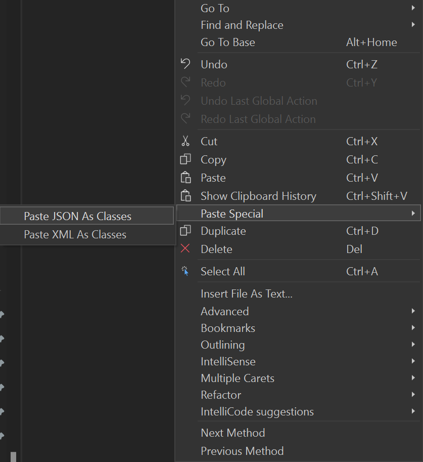

### Open Solution in Visual Studio

1. Open **1-Start/HomeRunLeaders.sln**

You should see 1 project:

- HomeRunLeaders - This is the main .NET MAUI project. This project targets Android, iOS, macOS, and Windows. It also includes some scaffolding for the app including Models, Views, ViewModels and Services.


### NuGet Restore

All the NuGet packages required should be installed. You will want to restore the packages from the internet.

1. **Right-click** on the **Solution** and select **Restore NuGet packages** 

### Models

There is a Model folder in the solution. All the models needed should already be there. The **Leaders**, **Player**, **Statistics**, and **Team** were generated from data retrieved from the web. 

1. Go to this URL [https://sports.core.api.espn.com/v2/sports/baseball/leagues/mlb/seasons/2024/types/2/leaders?lang=en&region=us](https://sports.core.api.espn.com/v2/sports/baseball/leagues/mlb/seasons/2024/types/2/leaders?lang=en&region=us) to see the Leader data that we will be working with. If you select all the returned data (ctrl-a, ctrl-c) and go to the Visual Studio Edit menu you will see the **Paste Special** option. Hover over it and you will see the **Paste Json as Classes** option. This is what was used to get this model as well as the Player model.



The HomeRuns model was built by hand. This is the model we will be displaying on the main page.

### Displaying Data

Before we go out and get actual data we will see how to display hard coded data based on our HomeRuns model

1. Open the **View/MainPage.xaml** file.
1. Add in a new namespace called model that points to the `HomeRunLeaders.Model` namespace.

```xml
xmlns:model="clr-namespace:HomeRunLeaders.Model"
```

This will allow us to reference the HomeRuns model for binding purposes.

Add the following into the MainPage.xaml's `ContentPage` section:

```xml
    <CollectionView>
        <CollectionView.ItemsSource>
            <x:Array Type="{x:Type model:HomeRuns}">
                <model:HomeRuns
                    Name="Mike Trout"
                    HomeRunsCount="6"
                    Jersey="27"
                    HeadShot="https://a.espncdn.com/i/headshots/mlb/players/full/30836.png"
                    Position="Center Field"/>
                <model:HomeRuns
                    Name="Marcell Ozuna"
                    HomeRunsCount="6"
                    Jersey="20"
                    HeadShot="https://a.espncdn.com/i/headshots/mlb/players/full/31668.png"
                    Position="Designated Hitter"/>
                <model:HomeRuns
                    Name="Mookie Betts"
                    HomeRunsCount="6"
                    Jersey="50"
                    HeadShot="https://a.espncdn.com/i/headshots/mlb/players/full/33039.png"
                    Position="Short Stop"/>
            </x:Array>
        </CollectionView.ItemsSource>
        <CollectionView.ItemTemplate>
            <DataTemplate x:DataType="model:HomeRuns">
                <HorizontalStackLayout Padding="10">
                    <Image
                    Aspect="AspectFill"
                    HeightRequest="100"
                    Source="{Binding HeadShot}"
                    WidthRequest="100" />
                    <Label VerticalOptions="Center" TextColor="Gray">
                        <Label.Text>
                            <MultiBinding StringFormat="{}{0} | {1}">
                                <Binding Path="Name" />
                                <Binding Path="Position" />
                            </MultiBinding>
                        </Label.Text>
                    </Label>
                </HorizontalStackLayout>
            </DataTemplate>
        </CollectionView.ItemTemplate>
    </CollectionView>
```

### Run the App

Ensure that you have your machine setup to deploy and debug to the different platforms:

* [Android Emulator Setup](https://docs.microsoft.com/dotnet/maui/android/emulator/device-manager)
* [Windows setup for development](https://docs.microsoft.com/dotnet/maui/windows/setup)

1. In Visual Studio, set the Android or Windows app as the startup project by selecting the drop down in the debug menu and changing the target to either an emulator.

2. In Visual Studio, click the "Debug" button or Tools -> Start Debugging
    - If you are having any trouble, see the Setup guides for your runtime platform

Running the app will result in a list of three MLB Players: