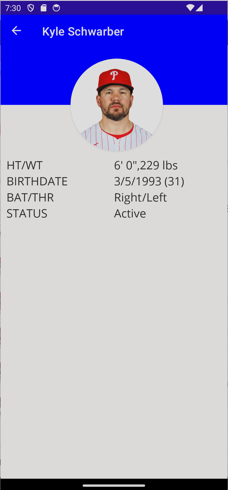

## Navigation

.NET Maui has built-in navigation as part of the Shell. This navigation system is based on URIs similar to how navigation on website works. Information can be passed as a `QueryProperty` as either a simple variable or as more complex objects.

We will be passing the HomeRuns object as part of our navigation. We will then parse out the Player ID and return the Player object to our details page.

### Add Selected Event

First will will need a way to return the player from our cached player data in the LeadersService class.

1. In `LeadersService.cs` add a method that will accept a player Id and return the player record.

    ```csharp
        public Player GetPlayer(string id)
        {
            if (players is null)
                return null;

            return players.FirstOrDefault(p => p.id == id);
        }
    ```

1. In `LeadersViewModel.cs`, create a method that will accept a HomeRun object and call our service and then redirect to the details page.

    ```csharp
        [RelayCommand]
        async Task GoToDetails(HomeRuns hrLeader)
        {
            if (hrLeader is null) 
            {
                return;
            }

            var player = leaderService.GetPlayer(hrLeader.Id);
            if (player is null) return;

            await Shell.Current.GoToAsync($"{nameof(DetailsPage)}", true,
                new Dictionary<string, object>
                {
                    {"Player", player }
                });
        }
    ```

    Notice how we are passing the player record throught the `GoToAsync` method. We will eventuall have to add the `QueryProperty` to our `PlayerViewModel.cs file` but not quite yet.

1. In `MainPage.xaml` we can add an `TapGestureRecognizer` event just inside of the `Frame` of our home run leader inside of the `CollectionView.ItemTemplate`:

    ```xml
    <Frame HeightRequest="125"
        Padding="0"
        Style="{StaticResource CardView}">
        <!-- add the following -->
        <Frame.GestureRecognizers>
            <TapGestureRecognizer 
                Command="{Binding Source={RelativeSource AncestorType={x:Type viewmodel:LeadersViewModel}}, Path=GoToDetailsCommand}"
                CommandParameter="{Binding .}"/>
        </Frame.GestureRecognizers>
    ```

    This uses a `RelativeSource` binding, which means that it isn't binding to the `HrLeader` anymore in the `DataTemplate`, but instead it is looking up the hierarchy specifically for an `AncestorType` of `LeadersViewModel`. This allows for more advanced scenarios like this.

### ViewModel for Details

1. Inside of our `ViewModel/PlayerViewModel.cs`, we will house our logic for assigning the player to the view model. Let's first create a bindable property for the `Player`:

    ```csharp
    public partial class PlayerViewModel : BaseViewModel
    {
        public PlayerViewModel() 
        { 

        }
        
        [ObservableProperty]
        Player player;
    }
    ```

1. Next, we will add a `QueryProperty` to handle passing the player data:
    
    ```csharp
    [QueryProperty(nameof(Player),"Player")]
    public partial class PlayerViewModel : BaseViewModel
    {
        public PlayerViewModel() 
        { 

        }
        
        [ObservableProperty]
        Player player;
    }
    ```

## Registering Routing

None of this will work if the system doesn't know about the route. So We have to tell the `AppShell` about it.

1. Open `AppShell.xaml.cs` code behind and add the following code into the constructor under the `InitializeComponent();` invoke:

    ```csharp
    Routing.RegisterRoute(nameof(DetailsPage), typeof(DetailsPage));
    ```

    This will register the details page with the route of "DetailsPage", which we used earlier.

1. Open `MauiProgram.cs` and add both the view model and the page as `Transient` so a new page and view model is created each time it is navigated to:

    ```csharp
            builder.Services.AddTransient<PlayerViewModel>();
            builder.Services.AddTransient<DetailsPage>();
    ```

1. Finally, we must inject the view model into our `DetailsPage`. Open the code behind for the page in `DetailsPage.xaml.cs` and change the constructor to the following:

    ```csharp
    public DetailsPage(PlayerViewModel viewModel)
	{
		InitializeComponent();
		BindingContext = viewModel;
	}
    ```

### Create DetailsPage.xaml UI

Let's add UI to the DetailsPage. Our end goal is to get a fancy profile screen like this:



1. Let's first start by defining our DataType by defining the view model namespace and also setting the title:

    ```xml
    <ContentPage xmlns="http://schemas.microsoft.com/dotnet/2021/maui"
             xmlns:x="http://schemas.microsoft.com/winfx/2009/xaml"
             x:Class="HomeRunLeaders.DetailsPage"
             xmlns:viewmodel ="clr-namespace:HomeRunLeaders.ViewModel"
             x:DataType="viewmodel:PlayerViewModel"
             Title="{Binding Player.displayName}">


    </ContentPage>
    ```

1. At the core is a `ScrollView`, `VerticalStacklayout>` and `Grid` to layout all of the controls nicely on the screen:

    ```xml
    <ScrollView>
        <VerticalStackLayout>
            <Grid ColumnDefinitions="*,Auto,*"
                  RowDefinitions="100, Auto">

            <!-- Background, Image of Player -->
        
            <!-- Details of Player -->

            </Grid>
        </VerticalStackLayout>
    </ScrollView>
    ```

1. We can now fill in our `Grid` with the following code to place a box as the background color of blue, and then our player image cut out in the shape of a circle:

    ```xml
    <BoxView BackgroundColor="{StaticResource Primary}"
            Grid.ColumnSpan="3"
            HeightRequest="100"
            HorizontalOptions="FillAndExpand"/>
    <Frame Grid.RowSpan="2"
                Grid.Column="1"
                HeightRequest="160"
                WidthRequest="160"
                CornerRadius="80"
                HorizontalOptions="Center"
                IsClippedToBounds="True"
                Padding="0"
                Margin="9,20,0,0">
        <Image Aspect="AspectFill"
            HeightRequest="160"
            HorizontalOptions="Center"
            VerticalOptions="Center"
            Source="{Binding Player.headshot.href}"
            WidthRequest="160"/>
    </Frame>
    ```

1. Finally, below the `Grid` but still inside the `VerticalStackLayout` we will add another `Grid` with the details of the player.

    ```xml
                <Grid ColumnDefinitions="*,*"
                  RowDefinitions="*,*,*,*"
                  Padding="10">
                <Label Grid.Column="0"
                       Grid.Row="0"
                       Text="HT/WT"
                       Style="{StaticResource LargeLabel}"/>
                <StackLayout Orientation="Horizontal"
                             Spacing="0"
                             Grid.Column="1"
                             Grid.Row="0">
                    <Label Text="{Binding Player.displayHeight, StringFormat='{0}, '}"
                           Style="{StaticResource LargeLabel}" />
                    <Label Text="{Binding Player.displayWeight}"
                           Style="{StaticResource LargeLabel}"/>
                </StackLayout>
                <Label Grid.Column="0"
                       Grid.Row="1"
                       Text="BIRTHDATE"
                       Style="{StaticResource LargeLabel}"/>
                <StackLayout Orientation="Horizontal"
                             Spacing="0"
                             Grid.Column="1"
                             Grid.Row="1">
                    <Label Text="{Binding Player.dateOfBirth, StringFormat='{0:d}'}"
                           Style="{StaticResource LargeLabel}" />
                    <Label Text="{Binding Player.age, StringFormat=' ({0})'}"
                           Style="{StaticResource LargeLabel}"/>
                </StackLayout>
                <Label Grid.Column="0"
                       Grid.Row="2"
                       Text="BAT/THR"
                       Style="{StaticResource LargeLabel}"/>
                <StackLayout Orientation="Horizontal"
                             Spacing="1"
                             Grid.Column="1"
                             Grid.Row="2">
                    <Label Text="{Binding Player.throws.displayValue}"
                           Style="{StaticResource LargeLabel}" />
                    <Label Text="{Binding Player.bats.displayValue, StringFormat='/{0}'}"
                           Style="{StaticResource LargeLabel}"/>
                </StackLayout>
                <Label Grid.Column="0"
                       Grid.Row="3"
                       Text="STATUS"
                       Style="{StaticResource LargeLabel}"/>
                <Label Grid.Column="1"
                       Grid.Row="3"
                       Text="{Binding Player.active"
                       Style="{StaticResource LargeLabel}"/>
            </Grid>
    ```

### Converters

If we were to run the application now it would look just like the image above, except that the status will be true or false and not Acive or Inactive. We can fix this by adding a converter to our code and then using it in the ui.

1. Inside the HomeRunLeaders project add a new folder called Converters.

1. Inside the folder add a new class called `BoolToStringConverter.cs` and add the following code:

    ```csharp
    using System.Globalization;

    namespace HomeRunLeaders.Converters
    {
        public class BoolToStringConverter : IValueConverter
        {
            public object Convert(object value, Type targetType, object parameter, CultureInfo culture)
            {
                if(value is bool boolValue)
                {
                    return boolValue ? "Active" : "Inactive";
                }
                return string.Empty;
            }
            public object ConvertBack(object value, Type targetType, object parameter, CultureInfo culture)
            { throw new NotImplementedException(); }
        }
    }
    ```

    The code uses IValueConverter so both Convert and ConvertBack must be defined.

1. Now go back to the `DetailsPage.xaml` and add a new namespace above the `Title=` line.

    ```xml
    xmlns:local ="clr-namespace:HomeRunLeaders.Converters"
    ```

1. Add the following code above the `ScrollView`:

    ```xml
    <ContentPage.Resources>
        <local:BoolToStringConverter x:Key="boolToString"/>
    </ContentPage.Resources>
    ```

    This says we are going to use the `BoolToStringConverter` and we are going to call it `boolToString` in our xaml.

1. Now replace the last label with the following code:

    ```xml
    <Label Grid.Column="1"
        Grid.Row="3"
        Text="{Binding Player.active, Converter={StaticResource boolToString}}"
        Style="{StaticResource LargeLabel}"/>
    ```

1. Now run the application - congratulations, you just created a MAUI app that uses data from the internet and has navigation between pages.    